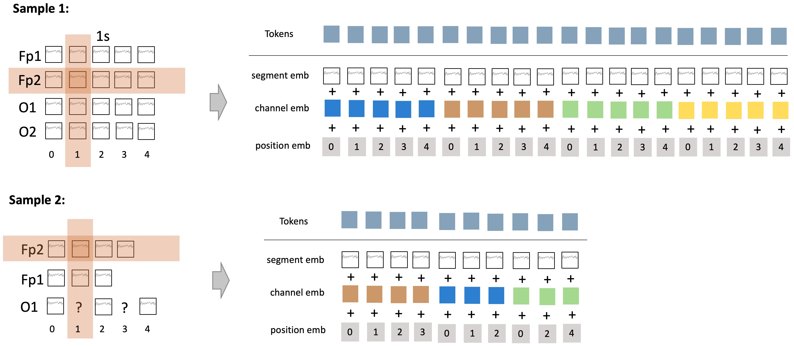
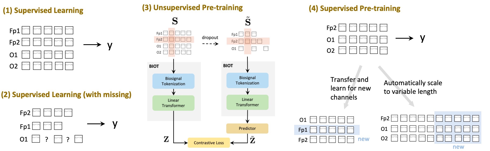

# BIOT: Cross-data Biosignal Learning in the Wild

**[Model]** We first resample biosignals into the same frequency, such as 200Hz. Then, we transform biosignals of <u>different channels</u>, <u>variable lengths</u>, and <u>with missing values</u> into the consistent sentence structures. Next, we apply a transformer model to encode the sentence embeddings.
<p align="center">
    
</p>    

**[Applications]** Our model can be used for standard supervised learning, supervised learning with missing values, (supervised and unsupervised) pre-training on multiple data sources with different formats and fine-tuning on similar new datasets.

<p align="center">
    
</p>    

## 0. Quick Start
- Understand the usage of each model (input and output)
```bash
# python run_example.py SPaRCNet
# python run_example.py ContraWR
# python run_example.py CNNTransformer
# python run_example.py FFCL
# python run_example.py STTransformer
python run_example.py BIOT
# python run_example.py BIOT-pretrain-PREST
# python run_example.py BIOT-pretrain-SHHS+PREST
# python run_example.py BIOT-pretrain-six-datasets 
```


## 1. Folder Structures
- **datasets/**: contains the dataset processing scripts for 
    - <u>The TUH Abnormal EEG Corpus (TUAB)</u>: 400K sample, 256Hz, 10 seconds per sample, 16 montages. https://isip.piconepress.com/projects/tuh_eeg/html/downloads.shtml
    - <u>The TUH EEG Events Corpus (TUEV)</u>: 110K samples, 256Hz, 10 seconds per sample, 16 montages. https://isip.piconepress.com/projects/tuh_eeg/html/downloads.shtml
    - <u>CHB-MIT</u>: 326K samples, 256Hz, 10 seconds per sample, 16 montages. https://physionet.org/content/chbmit/1.0.0/
    - <u>Sleep Heart Health Study (SHHS)</u>: 5M samples, 125Hz, 30 seconds per sample. https://sleepdata.org/datasets/shhs
- **models/**: contains the model scripts for 
    - <u>SPaRCNet [1]</u>: can refer to the implementation in https://pyhealth.readthedocs.io/en/latest/api/models/pyhealth.models.SparcNet.html 
    - <u>ContraWR [2]</u>: can refer to the implementation in https://pyhealth.readthedocs.io/en/latest/api/models/pyhealth.models.ContraWR.html or official github in https://github.com/ycq091044/ContraWR
    - <u>CNNTransformer</u>
    - <u>FFCL</u>
    - <u>STTransformer [3]</u>: can refer to https://github.com/eeyhsong/EEG-Transformer
    - <u>**Our BIOT Model**</u>: BIOTEncoder, BIOTClassifier, UnsupervisedPretrain, SupervisedPretrain

- **pretrained-models/**: contains the pretrained EEG models
> [1] Jing, J., Ge, W., Hong, S., Fernandes, M. B., Lin, Z., Yang, C., An, S., Struck, A. F., Herlopian, A., Karakis, I., et al. (2023). Development of expert-level classification of seizures and rhythmic and periodic patterns during eeg interpretation. Neurology.

> [2] Yang, C., Xiao, D., Westover, M. B., and Sun, J. (2021). Self-supervised eeg representation learning for automatic sleep staging. arXiv preprint arXiv:2110.15278.

> [3] Song, Y., Jia, X., Yang, L., and Xie, L. (2021). Transformer-based spatial-temporal feature learning
for eeg decoding. arXiv preprint arXiv:2106.11170.

## 2. EEG Pre-trained models (all re-sampled to 200Hz)
- `EEG-PREST-16-channels.ckpt`: pretrained model on 5 millions of resting EEG samples from Massachusetts General Hospital (MGH) EEG corpus. The sample size is 16 montages x 2000 time points. The 16 channels are "FP1-F7", "F7-T7", "T7-P7", "P7-O1", "FP2-F8", "F8-T8", "T8-P8", "P8-O2", "FP1-F3", "F3-C3", "C3-P3", "P3-O1", "FP2-F4", "F4-C4", "C4-P4", "P4-O2".
- `EEG-SHHS+PREST-18-channels.ckpt`: pretrained model on 5 millions samples from MGH EEG corpus and 5 millions of sleep EEG from SHHS. The SHHS sample size is 2 channels x 6000 time points. The 18 channels are the above 16 channels plus "C3-A2" and "C4-A1".
- `EEG-six-datasets-18-channels.ckpt`: pretrained on 5M MGH EEG samples, 5M SHHS, and the training sets of TUAB, TUEV, CHB-MIT, and IIIC Seizure (requested from [1]). The same 18 channels as above.

How to use the pretrained models:
- start wtih `run_example.py` to understand how to use these DL models 

To run your own pretrained models:
- use `run_supervised_pretrain.py` and `run_unsupervised_pretrain.py` for running the pre-training.


## 3. Performances on TUAB
- The first six models are trained from scratch. The last three models used the pre-trained BIOT.

| Models |   Balanced Acc. |   AUC-PR    | AUROC |
|--------------------------|:------------------------:|:------------------------:|:------------------------:|
| SPaRCNet                                                     | 0.7896  | 0.8414   | 0.8676   |
| ContraWR                                                     | 0.7746  | 0.8421   | 0.8456   |
| CNN-Transformer                                              | 0.7777  | 0.8433   | 0.8461   |
| FFCL                                                         | 0.7848  | 0.8448   | 0.8569   |
| ST-Transformer                                               | 0.7966  | 0.8521   | 0.8707   |
| BIOT (vanilla)                                               | 0.7925  | 0.8707   | 0.8691   |
| BIOT (pre-trained on EEG-PREST-16-channels.ckpt)             | 0.7907  | 0.8752   | 0.8730   |
| BIOT (pre-trained on EEG-SHHS+PREST-18-channels.ckpt)        | **0.8019**  | 0.8749   | 0.8739   |
| BIOT (pre-trained on EEG-six-datasets-18-channels.ckpt)      | 0.7959  | **0.8792**   | **0.8815**   |


##### Reference Runs
```bash
python run_binary_supervised.py --dataset TUAB --in_channels 16 --sampling_rate 200 --token_size 200 --hop_length 100 --sample_length 10 --batch_size 512 --model BIOT
python run_binary_supervised.py --dataset TUAB --in_channels 16 --sampling_rate 200 --token_size 200 --hop_length 100 --sample_length 10 --batch_size 512 --model BIOT --pretrain_model_path pretrained-models/EEG-PREST-16-channels.ckpt
python run_binary_supervised.py --dataset TUAB --in_channels 18 --sampling_rate 200 --token_size 200 --hop_length 100 --sample_length 10 --batch_size 512 --model BIOT --pretrain_model_path pretrained-models/EEG-SHHS+PREST-18-channels.ckpt
python run_binary_supervised.py --dataset TUAB --in_channels 18 --sampling_rate 200 --token_size 200 --hop_length 100 --sample_length 10 --batch_size 512 --model BIOT --pretrain_model_path pretrained-models/EEG-six-datasets-18-channels.ckpt
```

## 4. Performance on TUEV
- The first six models are trained from scratch. The last three models used the pre-trained BIOT.

| Models                                                    | Balanced Acc. | Kappa          | Weighted F1          |
|-----------------------------------------------------------|:------------------------:|:------------------------:|:------------------------:|
| SPaRCNet                                                       | 0.4161            | 0.4233  | 0.7024 |
| ContraWR                                                       | 0.4384            | 0.3912  | 0.6893 |
| CNN-Transformer                                                | 0.4087            | 0.3815  | 0.6854 |
| FFCL                                                           | 0.3979            | 0.3732  | 0.6783 |
| ST-Transformer                                                 | 0.3984            | 0.3765  | 0.6823 |
| BIOT (vanilla)                                                 | 0.4682            | 0.4482  | 0.7085 |
| BIOT (pre-trained on PREST)                                    | 0.5207            | 0.4932  | 0.7381 |
| BIOT (pre-trained on PREST+SHHS)                               | 0.5149            | 0.4841  | 0.7322 |
| BIOT (pre-trained on CHB-MIT with 8 channels and 10s)          | 0.4123            | 0.4285  | 0.6989 |
| BIOT (pre-trained on CHB-MIT with 16 channels and 5s)          | 0.4218            | 0.4427  | 0.7147 |
| BIOT (pre-trained on CHB-MIT with 16 channels and 10s)         | 0.4344            | 0.4719  | 0.7280 |
| BIOT (pre-trained on IIIC seizure with 8 channels and 10s)     | 0.4956            | 0.4719  | 0.7214 |
| BIOT (pre-trained on IIIC seizure with 16 channels and 5s)     | 0.4894            | 0.4881  | 0.7348 |
| BIOT (pre-trained on IIIC seizure with 16 channels and 10s)    | 0.4935            | **0.5316**  | 0.7555 |
| BIOT (pre-trained on TUAB with 8 channels and 10s)             | 0.4980            | 0.4487  | 0.7044 |
| BIOT (pre-trained on TUAB with 16 channels and 5s)             | 0.4954            | 0.5053  | 0.7447 |
| BIOT (pre-trained on TUAB with 16 channels and 10s)            | 0.5256            | 0.5187  | **0.7504** |
| BIOT (pre-trained on 6 EEG datasets)                           | **0.5281**            | 0.5273  | 0.7492 |


##### Reference Runs
```bash
python run_multiclass_supervised.py --dataset TUEV --in_channels 16 --n_classes 6 --sampling_rate 200 --token_size 200 --hop_length 100 --sample_length 5 --batch_size 128 --model BIOT
python run_multiclass_supervised.py --dataset TUEV --in_channels 16 --n_classes 6 --sampling_rate 200 --token_size 200 --hop_length 100 --sample_length 5 --batch_size 128 --model BIOT --pretrain_model_path pretrained-models/EEG-PREST-16-channels.ckpt
python run_multiclass_supervised.py --dataset TUEV --in_channels 18 --n_classes 6 --sampling_rate 200 --token_size 200 --hop_length 100 --sample_length 5 --batch_size 128 --model BIOT --pretrain_model_path pretrained-models/EEG-SHHS+PREST-18-channels.ckpt
python run_multiclass_supervised.py --dataset TUEV --in_channels 18 --n_classes 6 --sampling_rate 200 --token_size 200 --hop_length 100 --sample_length 5 --batch_size 128 --model BIOT --pretrain_model_path pretrained-models/EEG-six-datasets-18-channels.ckpt
```


## 5. Citations
```bibtex
@inproceedings{yang2023biot,
    title={BIOT: Biosignal Transformer for Cross-data Learning in the Wild},
    author={Yang, Chaoqi and Westover, M Brandon and Sun, Jimeng},
    booktitle={Thirty-seventh Conference on Neural Information Processing Systems},
    year={2023},
    url={https://openreview.net/forum?id=c2LZyTyddi}
}
@article{yang2023biot,
  title={BIOT: Cross-data Biosignal Learning in the Wild},
  author={Yang, Chaoqi and Westover, M Brandon and Sun, Jimeng},
  journal={arXiv preprint arXiv:2305.10351},
  year={2023}
}
```
